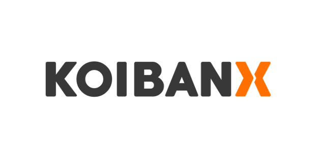

# Microservice-based Application with NestJS, DDD, CQRS, and Event Sourcing for Koibanxs backend callenge

## Description

This is an application built with NestJS that uses large-scale distributed microservice-based architectures like Domain-Driven Design ([DDD](https://martinfowler.com/bliki/DomainDrivenDesign.html)), Command Query Responsibility Segregation ([CQRS](https://martinfowler.com/bliki/CQRS.html)), and [event sourcing](https://martinfowler.com/eaaDev/EventSourcing.html). The application allows users to upload Excel (xlsx) files and process them based on a predefined mapping format. (At the moment there isn't a event store configured, but the application is ready to store all the events in a secont version). 

## Why These Architectures?

The decision to use a microservice architecture based on DDD, CQRS, and Event Sourcing was made to promote modularity, maintainability, and scalability. These architectures provide clear boundaries between different contexts, making it easier to maintain and test the application.

NestJS was chosen as the framework for building the application due to its extensive tooling, ease of use, and support for these architectures. NestJS also provides a robust platform for building microservices, with support for message brokers, load balancing, and scaling. It was chosen over Express due to its better support for building complex applications and its seamless integration with TypeScript.

##  Dependency Table

| Name        | Version           |
| ------------- |:-------------: |
| [Node.js](https://nodejs.org)      | 18.11.18      |
| [TypeScript](https://www.typescriptlang.org) | 4.7.4      |
| [Docker Compose](https://docker.com) | v2.4.1      |

## Installation

```bash
$ npm install
```

## Starting mongoDb container

```bash
# development
$ docker-compose up
```
## Configuration

create .env file in the project root. You can use de .env.example values

## Running the app
 
```bash
# development
$ npm run start
## Running the app

```bash
# development
$ npm run start

# watch mode
$ npm run start:dev
```

## Test

```bash
# unit tests
$ npm run test

# test coverage
$ npm run test:cov
```

## Api docs
Once the app is running open your browser and navigate to
```
http://localhost:3030/docs

```

the port :3030 and /docs path depends on your .env 

There you will find the services docs. once in swagger expand the api you want to test and click on try it out to set the api elements and send the request


## Stay in touch

- Author - [Carlos García](carlosgarcia0622@gmail.com)
- linkedIn - [https://www.linkedin.com/in/carlos-andr%C3%A9s-garc%C3%ADa-montoya-a35b8a121/](https://www.linkedin.com/in/carlos-andr%C3%A9s-garc%C3%ADa-montoya-a35b8a121/)

## License

Nest is [MIT licensed](LICENSE).
